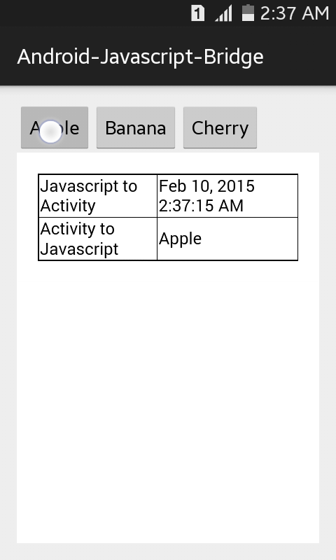
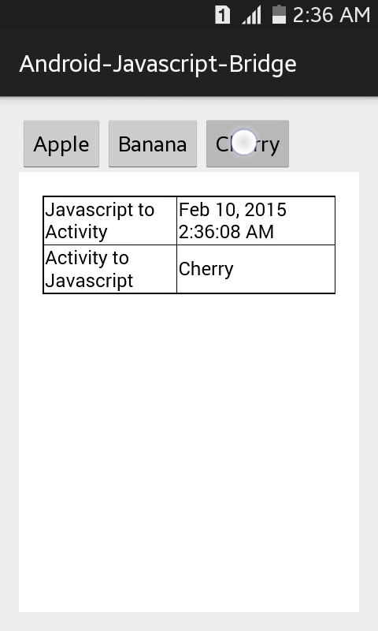

# Android-Javascript-Bridge

* Call Javascript methods from Android activity
* Call Android activity methods from Javascript

## Android to Javascript

In MainActivity.java

```java
String data = "Hello!";
webview.loadUrl("javascript:setData(\"" + data + "\");");
```

In index.html

```javascript
function setData(data) {
    alert(data);
    }
```

## Javascript to Android

In MainActivity.java

```java
public class JSInterface {
    JSInterface() {}
    
    @JavascriptInterface
    public String getData() {
        return "Hello";
    }
}

webview.addJavascriptInterface(new JSInterface(), "JSInterface");
```

In index.html

```javascript
var data = JSInterface.getData();
alert(data);
    }
```

## Screenshot ##


